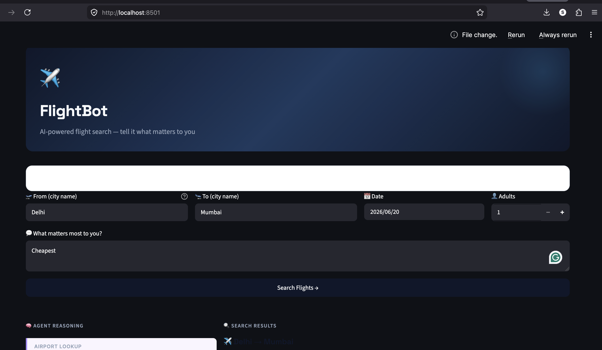
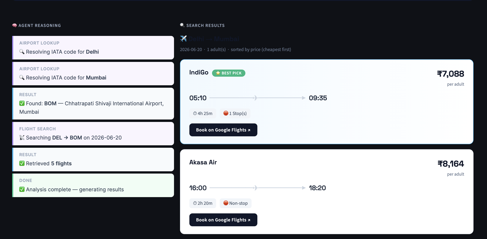
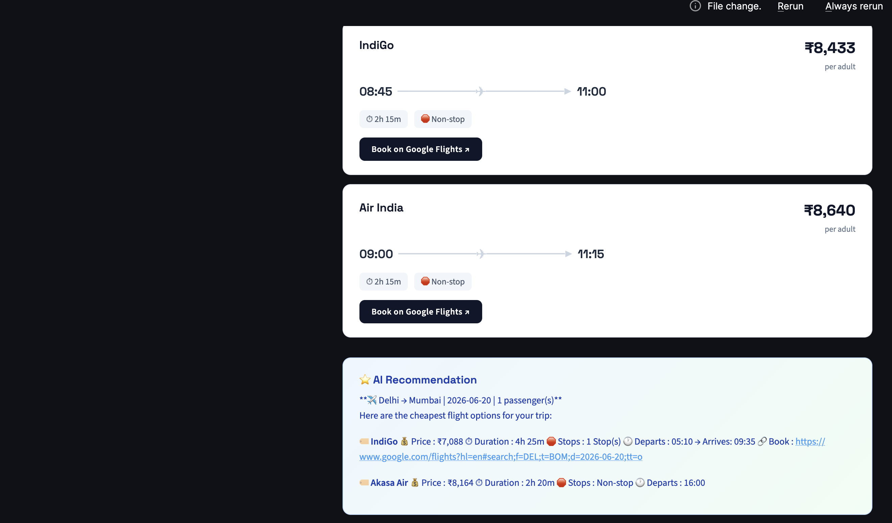

# ✈️ FlightBot — AI Flight Search Agent (Streamlit UI)

A LangGraph + Gemini powered flight search agent with a live web interface.

## Project structure

```
flight-agent-ui/
├── app.py              ← Streamlit web UI (run this)
├── graph.py            ← LangGraph agent (llm node + tool node)
├── state.py            ← Shared state TypedDict
├── prompts.py          ← System prompt builder
├── tools.py            ← Your tools (lookup_airport_code + search_robust_flights)
├── airports_list.dat   ← Your airport data file (place here)
├── .env                ← API keys (create from .env.example)
├── .env.example        ← Key template
└── requirements.txt
```

## Setup

### 1. Install dependencies
```bash
python -m venv venv
source venv/bin/activate        # Windows: venv\Scripts\activate
pip install -r requirements.txt
```

### 2. Add API keys
```bash
cp .env.example .env
```
Edit `.env`:
```
GEMINI_API_KEY=your_gemini_key
FLIGHT_SEARCH_API_key=your_searchapi_key
```

### 3. Place airport data
Put your `airports_list.dat` file in the project root.
(This is the OpenFlights format file your tools.py already reads.)

### 4. Run the app
```bash
streamlit run app.py
```
Opens at http://localhost:8501

## What the UI shows

**Left panel — Agent reasoning trace:**
- Each tool call is shown live as the agent reasons
- Airport lookup steps: "Resolving IATA code for Delhi"
- Flight search step: "Searching DEL → DXB on 2025-07-01"
- Tool results: "Found: DEL — Indira Gandhi Airport, Delhi"

**Right panel — Flight results:**
- Flight cards sorted by your stated preference
- Cheapest / Fastest / Recommended badges
- Departure + arrival times, duration, stops
- "Book on Google Flights" link for each flight
- AI recommendation box explaining the best pick for your needs

## How it works

```
User fills form (origin, dest, date, adults, preference)
          │
          ▼
  SystemMessage built with all form data
          │
          ▼
  LangGraph starts: llm_node (Gemini)
    → Gemini calls lookup_airport_code("Delhi")
    → ToolNode runs it → returns DEL
    → Gemini calls lookup_airport_code("Dubai")  
    → ToolNode runs it → returns DXB
    → Gemini calls search_robust_flights("DEL","DXB","2025-07-01")
    → ToolNode runs it → returns flight list
    → Gemini writes final recommendation
          │
          ▼
  app.py extracts raw flights + final text
  Renders flight cards sorted by user preference
  Shows booking links
```

## Deploying to Streamlit Cloud (free)

1. Push this folder to a GitHub repository
2. Go to share.streamlit.io → New app → select your repo
3. Set main file: `app.py`
4. Add secrets in Streamlit Cloud dashboard:
   ```
   GEMINI_API_KEY = "your_key"
   FLIGHT_SEARCH_API_key = "your_key"
   ```
5. Deploy — your app gets a public URL instantly

Note: `airports_list.dat` must be committed to the repo.

App Working output
#### App UI


#### Agent Working


#### Results
